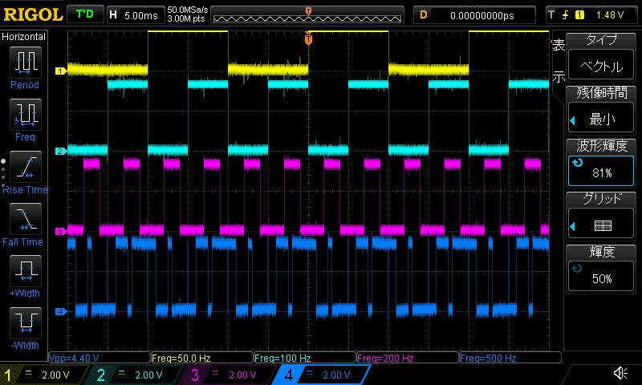

**English** | [日本語](README.ja.md) | [简体中文](README.zh.md)

# oscilloscope-mcp

An MCP server that lets an AI agent (Claude Code, Cursor, custom) operate a
real bench oscilloscope over the network.

There are two ways to use it:

**1. Interactive: you ask, the agent drives the scope.**
Instead of reaching over to the bench to turn knobs and click through the scope's
menus, you say what you want in plain language (*"trigger on the 2nd falling edge
of CH1"*, *"show me CH1–CH3"*, *"what's the frequency?"*), and the agent sets it
up on the instrument, reads it back, and shows you an interactive waveform view.

**2. As a feedback channel when an AI agent does the work.**
When you hand FPGA development to an AI agent, this gives it feedback on how the
design behaves on real hardware: the agent captures the real signals and checks
automatically whether they match what the RTL simulation predicted, so nobody has
to read the scope by eye to close the *"RTL sim PASS / HW FAIL"* gap.
It also works as a general input path: feed the state of various instruments to
the AI and let it act on what it sees.

Either way, you get the results in whatever form fits the job: **structured data
the agent can use directly as its next input** (measurements with caveats, edge /
run streams), a **PNG screenshot** for a quick human look, or a **self-contained
HTML viewer** that draws the measured samples in the browser.

*The scope is controlled under the hood over its standard SCPI interface, and you
never write it or even need to know it exists.*



*One MCP-driven capture: an AI agent set the timebase, V/div, per-channel
offset, channel labels, and trigger on a RIGOL DS1104Z, then pulled the
screenshot back to the user. The four traces are GPIO 26 / 19 / 13 / 17 on a
Raspberry Pi 4 driven at 50 / 100 / 200 / 500 Hz via `pigpio` DMA waveform
output, and the scope reads each one back exactly, confirming the whole loop
end to end. Every setting was made by the agent through this MCP server's
tools, with no hands on the front panel.*

## What makes it different

- **The agent is given everything the instrument can do, as data, not a thin
  wrapper around a few commands.** The full set of capabilities (for example,
  *all 15* DS1000Z trigger types and ~95 parameters) is declared in a
  machine-readable profile, taken from the official programming guide and verified
  on real hardware. The agent can ask *"what can I set here?"* and get back the
  parameters it can actually set, so it isn't limited to the few operations the
  tool's author happened to think of.

- **Natural language in, validated settings out.** Every request is checked
  against what the instrument actually supports; an impossible setting is
  rejected *before* it reaches the hardware. A bad request fails loudly instead
  of leaving the scope in a surprising state.

- **Every operation is also a reproducible, typed command.** The same thing you
  asked for interactively can be scripted, shared, and run in CI.

- **Structured facts, plus screenshots you can check.** The agent pulls out the
  numbers and caveats, and PNG screenshots come back for review (with optional
  cursor / channel-label annotation). Never a black box.

- **Self-contained HTML viewer.** One file, no dependencies, opens in any browser.
  It reads the measured RAW samples from the scope and draws them in the browser,
  up to the scope's full memory. The controls match the scope itself: per-channel
  V/div, drag the GND offset, a cursor that snaps to samples, channel on/off.

- **Sim-vs-hardware diff.** Give it a reference edge sequence (for example, from
  your RTL simulation) and it compares that against what the scope actually
  measured, returning structured *added / missing / shifted* edges.

- **Plug-in architecture.** Add a new vendor / model with two files: a SCPI-dialect
  driver and a capability profile YAML. Capability is declared data, not code.

- **Tested.** ~590 unit tests plus live conformance against real hardware.

> Drivers ship for the **RIGOL DS1000Z series** (DS1054Z / DS1074Z / DS1104Z)
> and the **ZLG ZDS1000 series** (ZDS1104). **DS1104Z** and **ZDS1104** are
> verified on real hardware; the other RIGOL models use the same code path
> and profile, but are not conformance-tested yet.

## Install

```bash
git clone https://github.com/masahiro-999/oscilloscope-mcp.git
cd oscilloscope-mcp

# Recommended: install into a dedicated environment (venv or conda env)
# so day-to-day package changes elsewhere can't break the server.
#   python -m venv .venv && source .venv/bin/activate
#   # or: conda create -n scope-mcp python=3.12 && conda activate scope-mcp
pip install -e .
```

## Run as MCP server

```bash
# Set the scope's network address.
export SCOPE_MCP_HOST=<your-scope-ip>     # e.g. 192.168.1.42

# Start the server (stdio transport, default).
python -m oscilloscope_mcp

# Or use the console script.
oscilloscope-mcp
```

## Register with an MCP host

The MCP host launches this server as a stdio subprocess, so connection
settings belong in the host registration rather than your shell
profile. Claude Code, user scope (available to all projects):

```bash
claude mcp add --scope user oscilloscope \
  --env SCOPE_MCP_HOST=192.168.1.42 \
  --env SCOPE_MCP_MODEL=ZLG_ZDS1104 \
  -- python -m oscilloscope_mcp
```

Or per-project: drop a `.mcp.json` in the repo root — the same shape
most MCP hosts (Claude Code, Cursor, …) pick up:

```json
{
  "mcpServers": {
    "oscilloscope": {
      "command": "<absolute path to the dedicated env's python>",
      "args": ["-m", "oscilloscope_mcp"],
      "env": {
        "SCOPE_MCP_HOST": "192.168.1.42",
        "SCOPE_MCP_MODEL": "ZLG_ZDS1104"
      }
    }
  }
}
```

- Point `command` at the Python of the environment you installed into,
  preferably by absolute path — a GUI-launched host may have a different
  `PATH` than your shell.
- Setting `SCOPE_MCP_MODEL` (and optionally `SCOPE_MCP_PORT`) skips the
  port-probe + `*IDN?` auto-detect round-trip that would otherwise run
  before every tool call. See [Environment](#environment) for all
  variables.

**Several scopes on one bench**: register one entry per instrument and
let the entry name carry the identity. With the two entries below, a
trigger call is `mcp__scope-rigol__scope_trigger` or
`mcp__scope-zds__scope_trigger`, so the prefix alone tells you — and the
agent — which instrument the command will reach; a capture cannot
silently land on the scope next to it.

```json
{
  "mcpServers": {
    "scope-rigol": {
      "command": "<absolute path to the dedicated env's python>",
      "args": ["-m", "oscilloscope_mcp"],
      "env": {
        "SCOPE_MCP_HOST": "192.168.1.42",
        "SCOPE_MCP_PORT": "5555",
        "SCOPE_MCP_MODEL": "RIGOL_DS1104Z"
      }
    },
    "scope-zds": {
      "command": "<absolute path to the dedicated env's python>",
      "args": ["-m", "oscilloscope_mcp"],
      "env": {
        "SCOPE_MCP_HOST": "192.168.1.43",
        "SCOPE_MCP_PORT": "5025",
        "SCOPE_MCP_MODEL": "ZLG_ZDS1104"
      }
    }
  }
}
```

A second instrument you only touch occasionally can also ride on a
single entry: every tool accepts optional `host` / `port` / `model`
arguments that override the registration env for that one call (pass
all three to skip the auto-detect round-trip). Prefer one entry per
instrument for regular use — with a single entry, any call that omits
`host` goes to the default scope, so reaching the other one depends on
passing the arguments every time.

Then the `scope_query`, `scope_screenshot`, `scope_trigger`,
`scope_measure`, `scope_measure_stat`, `scope_channel`, `scope_timebase`,
`scope_waveform`, `scope_acquire`, `scope_capture`, `scope_compare`,
and `scope_viewer` tools become available to any session that connects
to this MCP server.

## Tools exposed

| MCP tool | Purpose |
|---|---|
| `scope_query` | Raw SCPI command passthrough. Returns the response plus a `caveats[]` warning that observation limits are not auto-checked on this path. |
| `scope_screenshot` | Save a PNG of the current scope screen for user review. Optionally place manual cursors (Δt / ΔV) and channel labels (DIR / STP / NXT / CLK) to make the image easy to read. |
| `scope_trigger` | Read or configure the trigger; it covers **every** trigger type the instrument supports. Call with no arguments to **read** the current state (returns `mode`, globals, the mode's `params`, and `accepted_params` describing what's settable). To **set**, pass `mode` and/or the global `sweep` / `coupling` / `holdoff_s`, and put all type-specific parameters in a `params` object (e.g. `{"source":"CHAN1","slope":"NEG","nth_edge":2,"idle_s":2e-3}` for an Nth-edge trigger). `mode` is validated against the profile's full type list (6 standard + 9 option-licensed DS1000Z types), and each `params` key/value is validated against that mode's schema (enum membership, numeric range, channel source). Unsupported types/params are rejected with the valid list; option-licensed types emit a `caveats[]` warning. Pass `action` to control acquisition: `RUN` / `STOP` / `SINGLE` (arm one shot) / `FORCE` (force a trigger; NORMAL/SINGLE sweep only). `status` (TD/WAIT/RUN/AUTO/STOP) reflects the result. |
| `scope_measure` | Read scope-side automatic measurements (`:MEAS:ITEM?`) for a list of `items` on a `source` channel. Single-source items: `VMAX VMIN VPP VTOP VBASE VAMP VAVG VRMS OVERSHOOT PRESHOOT PERIOD FREQUENCY RTIME FTIME PWIDTH NWIDTH PDUTY NDUTY`; two-source (require `source2`): `RDELAY FDELAY RPHASE FPHASE`. Un-measurable values come back as `null` with a caveat. |
| `scope_measure_stat` | Read measurement **statistics** (`:MEASure:STATistic:ITEM`) for one or more items on a source: the accumulated current/max/min/average/deviation/count, rather than a single instantaneous value. `stat_types` defaults to all six (`CURRent MAXimum MINimum AVERages DEViation COUNt`); pass a subset to limit the query. `mode` optionally sets the statistics mode (`DIFFerence` / `EXTRemum`). `reset=True` clears accumulated data before querying. Returns `{source, statistics: [{item, current, max, min, avg, dev, count}], caveats}`. |
| `scope_channel` | Read or configure an analog channel's **vertical** setup. `channel` (1-based) is required. Pass any subset of `scale_v_per_div`, `offset_v`, `coupling` (AC/DC/GND), `display`, `probe`, `bw_limit` (20M/OFF), `invert`, `units`. Validated against the profile; 20 MHz BW limit emits a caveat. |
| `scope_timebase` | Read or configure the **horizontal** (timebase) setup. Pass any subset of `s_per_div`, `offset_s`, `mode` (MAIN/XY/ROLL). Validated against the profile; long timebase emits a memory-downgrade caveat. |
| `scope_waveform` | Capture one channel and return a compact **threshold-quantized event stream**, not raw ADC samples. Raw volts pass through a Schmitt-trigger comparator (`threshold_v` ± `hysteresis_v`/2) into a 0/1 stream, then run-length-encoded into `runs` `[(t_us, level, dur_us)]` and `edges` `[(t_us, channel, RISE/FALL)]` (times in µs, trigger at t=0). Hysteresis is mandatory: a single threshold on a noisy edge fragments into useless micro-pulses. A `hysteresis_v` over 20 % of the signal peak-to-peak emits a detection-miss `caveats[]` warning; an over-budget stream is truncated with a caveat. Args: `source` (default `CHAN1`), `mode` (`NORMal` or `RAW`; RAW reads the **full acquisition memory** up to 24M points instead of the ~1200-point screen decimation, and the scope must be stopped first), `threshold_v` (1.5), `hysteresis_v` (0.1). |
| `scope_acquire` | Read or configure the **acquisition mode**: `type` (NORMal/AVERages/PEAK/HRESolution), `averages` (2..1024 powers of 2), and `memory_depth` (AUTO or numeric, validated per active channel count). Call with no args to **read** (returns type, averages, memory_depth, sample_rate). Selecting AVERages emits a `caveats[]` warning that the update rate is reduced. |
| `scope_capture` | **Declarative single-shot capture**: configure, arm, wait, and read in one call. Composes trigger/channel/timebase/acquire setup, arms `:SINGle`, polls until triggered (or `timeout_s`), then reads per-channel waveforms (quantized to `runs`/`edges`/`bus_runs`), scope-side `measurements`, and an optional screenshot. Use `sweep='AUTO'` or `'NORMAL'` to skip arm+poll and read the current screen memory immediately. Set `waveform_mode='RAW'` to read the full acquisition memory after the trigger fires (scope is already stopped after SINGLE). Returns `{triggered, channels, waveform, bus_runs, measurements, screenshot_path, caveats}`. |
| `scope_compare` | **Sim vs HW reference diff**: the project's core goal. Takes a golden edge/run list from your RTL simulator and compares it against hardware (live capture or provided data). Returns `{matched, shifted[{ref_t_us, hw_t_us, delta_us, kind}], missing[{t_us, kind}], added[{t_us, kind}], first_divergence_us, summary, caveats}`. Two modes: *live* (captures from scope if `hw_runs`/`hw_edges` not provided) or *offline* (pass pre-captured data directly, no scope connection needed). `tolerance_us` (default 0.05 = 50 ns) sets how close two same-kind edges must be to count as a match. Signal-agnostic: works on SPI, I2C, UART, ULPI, or any digital signal. |
| `scope_viewer` | Generate a **self-contained interactive HTML** waveform viewer. Reads RAW waveform data (scope must be stopped) and embeds the measured analog voltage samples into an HTML file. Features: per-channel ON/OFF toggle, per-channel V/div dropdown (10mV–100V), draggable GND offset markers (▶), T/div dropdown with 1-2-5 auto-stepping on scroll-zoom, drag-to-pan, vertical cursor snapped to sample points with fixed voltage readout, trigger position marker (▼T at t=0, derived from `:TRIG:POS?`). `depth` controls observation window centered on the trigger: `"low"` (30k pts, ~120µs, ~1s transfer), `"mid"` (300k, ~1.2ms, ~3s), `"high"` (3M+, ~12ms, ~17s). A bigger depth transfers more slowly, so a window around the trigger is the usual choice, with the scope's full memory as the upper limit. Browser renders millions of points via per-pixel min/max envelope when zoomed out, individual samples + dots when zoomed in. |

## Layout

```
oscilloscope-mcp/                 # repo (kebab-case)
├── README.md
├── LICENSE
├── pyproject.toml
├── src/oscilloscope_mcp/         # Python package (snake_case)
│   ├── __init__.py
│   ├── __main__.py           # `python -m oscilloscope_mcp` entry
│   ├── server.py             # FastMCP server: tool registration + dispatch
│   ├── transport/
│   │   └── scpi_lan.py       # raw TCP SCPI client (zero third-party deps)
│   ├── instruments/
│   │   ├── _base.py          # Scope ABC, vendor-agnostic interface
│   │   ├── __init__.py       # MODEL_REGISTRY + open_scope() dispatch
│   │   ├── rigol_ds1000z.py  # RIGOL DS1054Z / DS1104Z driver
│   │   ├── zlg_zds1000.py    # ZLG ZDS1000-series driver (ZDS1104)
│   │   └── profiles/
│   │       ├── _ds1000z_family.yaml  # shared trigger + acquisition schema
│   │       ├── rigol_ds1104z.yaml
│   │       ├── rigol_ds1054z.yaml
│   │       ├── _zds1000_family.yaml  # ZDS1000 family schema
│   │       └── zlg_zds1104.yaml
│   └── helpers/
│       ├── caveat_calc.py    # capability + current setting → caveats[]
│       ├── trigger.py        # trigger profile: validate / normalize / caveats
│       ├── measure.py        # measurement profile: validate / normalize / parse
│       ├── acquisition.py    # channel + timebase profile validation
│       ├── quantize.py       # raw volts → 0/1 stream (Schmitt hysteresis)
│       ├── rle.py            # digital stream → runs[(t_us, level, dur_us)]
│       ├── edges.py          # runs → edges[(t_us, ch, RISE/FALL)]
│       ├── bus.py            # multi-channel runs → bus_runs[(t_us, value, dur_us)]
│       ├── reference_diff.py # sim vs HW edge diff (the whole point of the project)
│       ├── viewer.py         # self-contained HTML waveform viewer generator
│       ├── glitch_list.py    # runs < min_width (runt/glitch detection)
│       ├── edge_interval_stats.py  # jitter / clock stability stats
│       ├── pattern_search.py # RLE bit-pattern template matching
│       ├── voltage_histogram.py    # voltage distribution / bimodal detection
│       ├── fft_peaks.py      # top-N frequency peaks (EMI / switching noise)
│       ├── causality_check.py      # cross-channel "B follows A within N µs"
│       └── envelope_downsample.py  # min/max decimation for visualization
└── tests/                    # unit + live conformance
```

## Environment

| Env var | Required | Meaning |
|---|---|---|
| `SCOPE_MCP_HOST` | yes | scope IP or hostname |
| `SCOPE_MCP_PORT` | no | SCPI TCP port. Unset → the selected model profile's `default_port` (RIGOL 5555, ZLG 5025); for `*IDN?` auto-detect the common ports (5555, 5025) are probed |
| `SCOPE_MCP_MODEL` | no | model key (e.g. `RIGOL_DS1104Z`). If unset, `*IDN?` is parsed and matched against each profile's `idn_match` regex |

Env-var prefix `SCOPE_MCP_*` is project-specific so it does not collide
with other shells driving unrelated tools.

## Adding a new instrument

Two new files plus one registry line:

1. **profile** (`src/oscilloscope_mcp/instruments/profiles/<model>.yaml`):
   capability (analog BW, sample rate per channel count, memory depth,
   `idn_match` regex).
2. **driver** (`src/oscilloscope_mcp/instruments/<vendor>_<series>.py`):
   subclass `oscilloscope_mcp.instruments._base.Scope`, implement each
   abstract method using the vendor's SCPI dialect.
3. **registry line**: add an entry to `MODEL_REGISTRY` in
   `src/oscilloscope_mcp/instruments/__init__.py`.
4. **conformance test**: run

   ```bash
   SCOPE_MCP_HOST=<ip> \
   SCOPE_MCP_CONFORMANCE_MODEL=<MODEL_KEY> \
   pytest tests/test_instrument_conformance.py -v
   ```

No other module changes are required.

## Limits (tool warnings)

All structured outputs include a `caveats[]` field. Going outside a limit the
profile declares (for example, 4-channel mode forces 250 MSa/s on a DS1000Z,
which drops practical observation to ~25 MHz) automatically adds a caveat. The
agent must read `caveats[]` before trusting any number.

## Verified on real hardware

Everything below was tested against a live RIGOL **DS1104Z** (the
`tests/test_instrument_conformance.py` suite): connection / IDN, raw SCPI,
screenshot, channel / timebase / acquire read+set, measurements and statistics,
waveform capture in **NORMal and RAW (full memory)**, declarative `scope_capture`,
run control, trigger **mode** switching across all 15 types, and the validation
(rejection) paths.

The same suite passes against a live ZLG **ZDS1104** (fw 1.2.67): connection /
IDN / port auto-detect, raw SCPI, BMP screenshot, channel / timebase / acquire
read+set, measurements and statistics, waveform capture in **SCREen and MEMOry
(full memory, requires STOP — enforced)**, single-shot `scope_capture`, run
control, trigger mode switching across all 11 types, and the rejection paths.
The ZDS1000 binary WFM layout and the 8-bit sample encoding (code 128 = screen
center, 25 codes/div, screen-referred) were pinned down on that unit via a
GND-coupling calibration. ZDS1000-specific notes: screenshots are **BMP only**
(a PNG request falls back to BMP), `SINGLE` is a run-control action (not a
sweep mode), and the `FORCE` run action has no SCPI equivalent registered yet.

Built from the official programming guide and unit-tested, but **not yet
confirmed on real hardware**. Treat these as based on the spec until they are
verified:

- **Per-trigger-type parameters beyond EDGE** (pulse width, slope time, the
  RS232 / IIC / SPI fields, …). Every type's parameter ranges / enums come from
  the guide and are validated before anything is sent, and the *mode* switch is
  hardware-checked for all 15 types, but the individual parameters of the
  non-EDGE types are not each tested on hardware.
- **Acquire types other than `NORMal`** (AVERages / PEAK / HRESolution) and
  explicit `memory_depth` values.
- **`scope_compare` against a real simulation.** The diff engine is unit-tested
  and verified on real captured edges shifted by a known amount, but a genuine
  *RTL-simulation-output vs hardware-capture* run has not been done yet.
- **Models other than DS1104Z** (DS1054Z / DS1074Z) and **ZDS1000 models
  other than ZDS1104**: same code path + profile, not conformance-tested.

## Security / trust model

This is a **local-only stdio MCP server**. It speaks to an MCP client
over its parent process's stdin/stdout, and it does not open any network
port. The client (Claude Code, Cursor, your own agent) launches it as
a subprocess, and the trust boundary is the local user account.

Within that boundary:

- `scope_query` is a **raw SCPI passthrough** with no command
  validation. Any SCPI the client sends is forwarded to the scope.
  That is intentional: SCPI on a bench scope is mostly read operations,
  and even changes that alter the setup (timebase, channel scale,
  trigger) are easy to undo. But it does mean an agent with this MCP
  server enabled can fully reconfigure your scope and read everything
  on its screen. Use it accordingly.
- The SCPI connection to the scope itself is **unauthenticated TCP**
  on the scope's LAN port (RIGOL DS1000Z uses 5555, ZLG ZDS1000 uses
  5025). Anything on the
  same network can already talk to the scope. Installing this MCP
  server does not change that; it just gives the AI agent the same
  access you already have.

If you want to lock down the scope further, do it on the scope's
network (VLAN, firewall) rather than at this layer. The MCP server is
not the right place to police what an agent on the same machine can
ask the scope to do.

## Tests

```bash
# Unit tests (no hardware).
pytest tests/ -v

# Live conformance against a real scope.
SCOPE_MCP_HOST=<your-scope-ip> \
  pytest tests/test_instrument_conformance.py -v
```

## Adding support for your instrument

Any oscilloscope with a **publicly documented control interface** (SCPI or
otherwise) can be supported. Thanks to the plug-in architecture above, a new
vendor / model is just a driver subclass plus a capability profile, with no
changes to the core. See *Adding a new instrument*.

**Forks that add instrument support are welcome.** Requests are too: open an
issue for an instrument you'd like supported (a link to its programming guide
helps) and we'll consider it.
